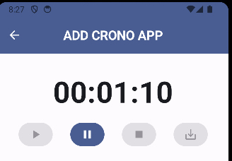

# Cronos App



Cronos App is a time-tracking application designed to help you store and manage times for various tasks. Built with Kotlin and Jetpack Compose, Cronos App offers a modern and efficient way to keep track of your tasks directly from your Android device.

## Features

- Add, edit, and delete task times
- View a list of all tracked tasks
- User-friendly interface with Jetpack Compose
- Persistent storage using Room Database
- Asynchronous data handling with Kotlin Coroutines

## Technology Stack

- **Kotlin**: The programming language used for Android development.
- **Jetpack Compose**: The modern toolkit for building native Android UI.
- **Room Database**: For local data storage.
- **Kotlin Coroutines**: For asynchronous programming.
- **Android Studio**: The IDE used for development.

## Installation

To run Cronos App on your local machine:

1. Clone this repository:
    ```bash
    git clone https://github.com/yourusername/cronos-app.git
    ```

2. Open the project in Android Studio.

3. Build and run the project on an Android device or emulator.

## Usage

1. Open the app.
2. Add a new task by clicking on the "Add Task" button.
3. Enter the task details and save.
4. View and manage your tasks from the main screen.

## Contributing

We welcome contributions to Cronos App! To contribute:

1. Fork the repository.
2. Create a new branch for your feature or bugfix.
3. Commit your changes.
4. Push to the branch.
5. Create a pull request.

## License

Cronos App is licensed under the MIT License. See the [LICENSE](LICENSE) file for more details.

## Contact

If you have any questions or suggestions, feel free to contact us at [your-email@example.com](mailto:miguel.vilata@gmail.com).

---

Thank you for using Cronos App!
